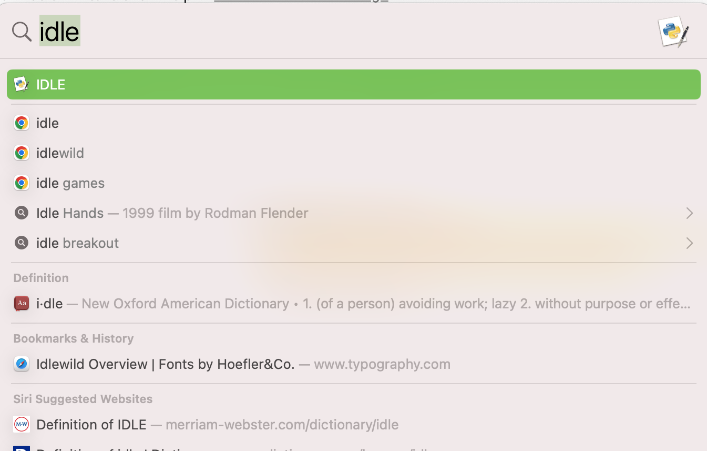
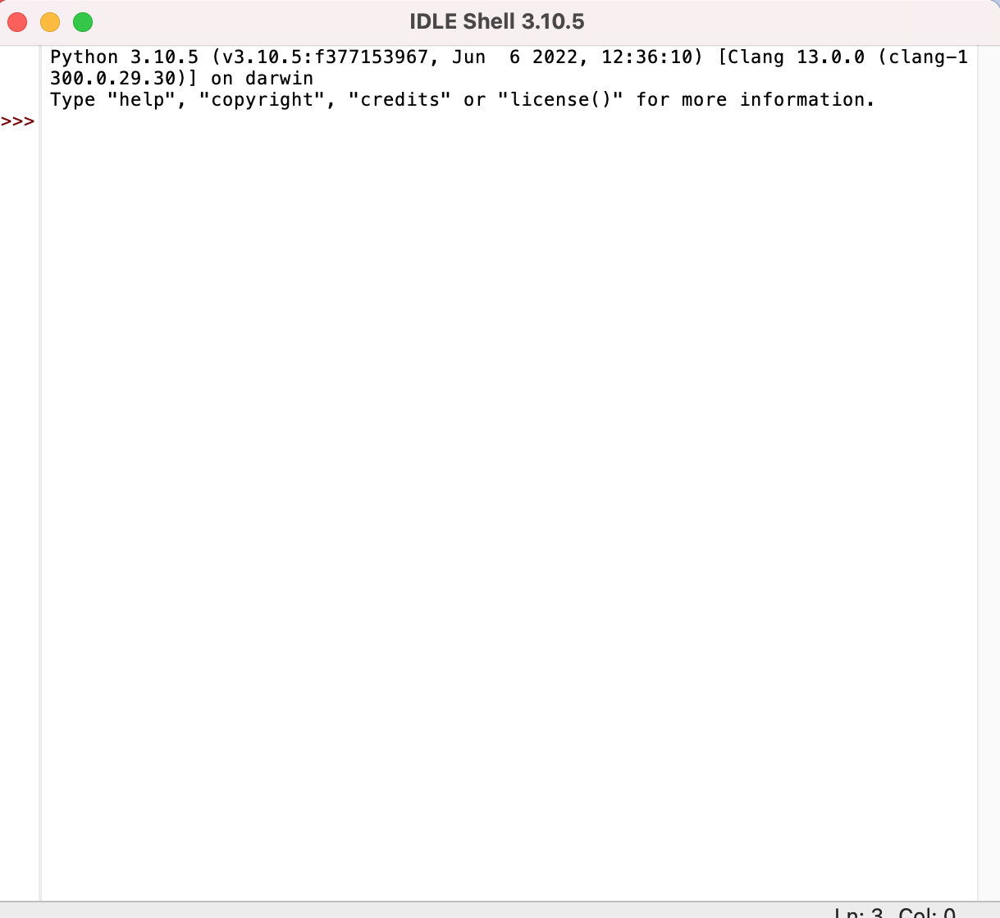

# Ninja Python Puzzle Tutorial

## Introduction

The purpose of this document is to explain how to run a puzzle in Python for beginners. It can be easy to become overwhelmed by learning a new coding language. Trying simple puzzles like this one can make it easier to understand.

This particular puzzle was found in a [Python for Kids](https://www.amazon.com/Python-Kids-Playful-Introduction-Programming/dp/1593274076/ref=asc_df_1593274076/?tag=hyprod-20&linkCode=df0&hvadid=312125971120&hvpos=&hvnetw=g&hvrand=476739474878251740&hvpone=&hvptwo=&hvqmt=&hvdev=c&hvdvcmdl=&hvlocint=&hvlocphy=9004368&hvtargid=pla-406163956273&psc=1&tag=&ref=&adgrpid=61316180839&hvpone=&hvptwo=&hvadid=312125971120&hvpos=&hvnetw=g&hvrand=476739474878251740&hvqmt=&hvdev=c&hvdvcmdl=&hvlocint=&hvlocphy=9004368&hvtargid=pla-406163956273/) book. Python, though considered one of the most user friendly coding languages, still requires time and dedication to learn.

## Puzzle

```
 #4 I Can Fight those Ninjas

         Create an if statement that
         prints the string 'That's too
         many!'

         If the variable ninjas
         contains a number that's less
         than 50, prints: 'it will be a
         struggle, but I can take em.'

         If it's less than 30, and
         prints 'I can fight these
         ninjas!' if it's less than
         10.
```

---

## Definitions

| Term             | Definition                                                                    |
| ---------------- | ----------------------------------------------------------------------------- |
| `Variable `      | A term to store information that can be reused.                               |
| `String `        | A sequence of characters                                                      |
| `Elif statement` | Short for Else if, is a conditional statment that checks for other variables. |
| `IDLE`           | an integrated development environment for Python                              |

---

> <b>PREREQUISITE:</b> Download [Python](https://www.python.org/downloads/) prior to starting tutorial.

1.  Open **IDLE** located on your computer.

    1.  Click the `search bar` on your computer.

        - For [Mac](https://support.apple.com/en-asia/guide/mac-help/mchlp1008/mac) the seach bar is located in the upper right hand corner.
        - For [PC](https://support.microsoft.com/en-us/windows/search-for-anything-anywhere-b14cc5bf-c92a-1e73-ea18-2845891e6cc8#:~:text=To%20show%20the%20search%20box,toggle%2Fclear%20Show%20search%20highlights.) use the shortcut by holding the `Windows logo + S`.

    2.  Type **IDLE**.

        

        &#x2611; The `IDLE box` will open.

        

        > This should be running on the latest version of Python.

2.  Label a variable **“ninjas”**.
3.  Set the variable **equal to “5”**.

            Ninjas = 5

4.  Label another variable **ninjas** under the initial.
5.  Set this variable to **greater than or equal to 100**.

            Ninjas <= 100

6.  Add below:

        Print(‘’’That’s too many!’’’)

    > This is to create the condition stating if there are 100 or more ninjas, then you cannot fight them.

7.  Label another variable **ninjas** under the last.
8.  Set this variable to **greater than or equal to 50**.

            Ninjas <= 50

9.  Add below:

            Print(‘’’It will be a struggle, but I can take em.’’’)

    > This is to create the condition stating if there are 50 or more ninjas, then you will struggle to fight.

10. Lastly, label another variable **ninjas** under the previous.
11. Set this variable to **greater than or equal to 30**.

            Ninjas <= 30

12. Add below:

        “Print(‘’’I can fight those ninjas!’’’)**

    &#x2611; You have successfully completed your first puzzle for `Python`.
